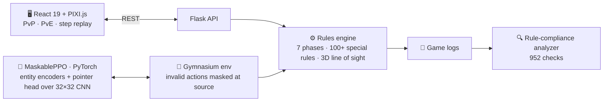

<h1 align="center">Hi, I'm Gregory Souquet 👋</h1>

  <b>ML / RL Engineer</b> — I design and ship complex simulation software end to end: 
  rules engine → reinforcement-learning agent → production deployment.

  
  &nbsp;
  

---

## 🎮 Warhammer 40K Tactical Simulator

  
   
  <i>Movement phase, Orks vs Space Marines — WebGL board with terrain & line-of-sight overlays, live unit datasheets, event log.</i>

A complete turn-based tactics engine with a **self-training AI opponent**, built solo from scratch: the full tabletop ruleset, a React/WebGL client to play it, and an RL pipeline that learns to play it better than scripted bots.

  
  
  
  

### How it fits together

### 🧠 The AI
- **MaskablePPO** with shared-weight entity encoders and a pointer head over a 32×32 CNN (AlphaStar-inspired) — 1,389 boolean-masked actions per step
- **Progressive self-play**: 15 curriculum stages from isolated mechanics to full-game strategy, plus exploiters (OpenAI League approach)
- **Benchmark saturated**: 90%+ win rate against 6 bots with different strategies

### ⚙️ The engine
- 7 game phases, multi-level 3D line of sight, 100+ special rules implemented **from the official PDFs**, not from memory
- **One engine, zero divergence**: PvP hot-seat, PvE and the training environment run the exact same code path
- Engine-invariant linters and a 952-check compliance analyzer replay real game logs against the rules at every commit

### 🖥️ The product
- React 19 / TypeScript / PIXI.js (WebGL) client — PvP, PvE against the trained agent, step-by-step replay, 6 playable factions
- Flask REST API, Docker Compose + Nginx + TLS, self-hosted on a Synology NAS
- `pyright` strict · `tsc --noEmit` · Biome · 8,600+ pytest + vitest tests

<b>More on the training pipeline</b>

 

- Custom Gymnasium environment wrapping the engine; observations = entity lists + 32×32 spatial grid; actions = decision types × unit slots × targets
- Curriculum: each stage adds mechanics (move → shoot → charge → fight → objectives), evaluation on a held-out opponent pool before promotion
- Exploiters trained against the current champion to close its blind spots, then folded back into the pool
- TensorBoard telemetry per action family, action-usage audit tools, replayable decision logs

---

## 🛠 Tech stack

  
  
  
  
  
   
  
  
  
  
   
  
  
  
  
  
  

---

## 📊 GitHub stats

  
  &nbsp;
  

  

---

## 📫 Let's talk

Open to **full-stack** or **AI/ML engineering** roles.
[LinkedIn](https://www.linkedin.com/in/YOUR-HANDLE) · [Open an issue on the 40k repo](https://github.com/GregSQT/40k/issues) if you want to discuss the architecture.
