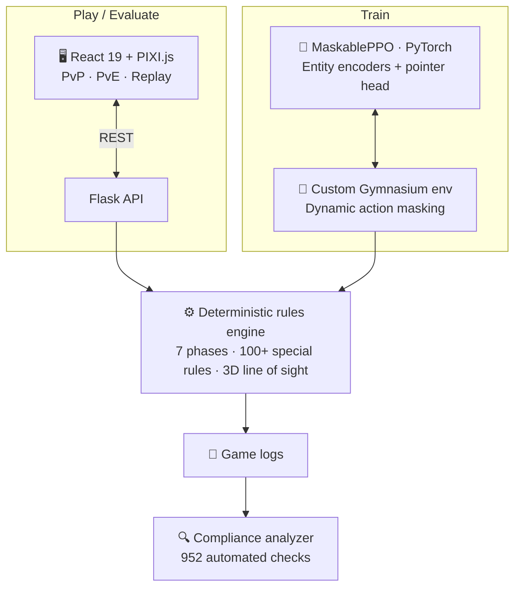

<h1 align="center">Hi, I'm Gregory Souquet 👋</h1>

  <b>ML / RL Engineer</b> · Python · Reinforcement Learning · Software Engineering

  I design and ship complex AI systems end to end — from deterministic simulation engines 
  and rule validation to reinforcement-learning agents, evaluation pipelines and production deployment.

  
  &nbsp;
  

---

## 🧠 Featured Project — Tactical Simulation & Reinforcement Learning

  
   
  <i>Full-stack tactical simulation: WebGL client, deterministic rules engine, 3D line of sight, live game state and replay.</i>

**A full-stack simulation and reinforcement-learning platform built from scratch.**

The project combines a deterministic, rule-driven simulation engine with a custom RL environment, a self-training agent, automated evaluation and a playable web client.

The game is the application domain; the engineering challenges are **simulation, decision-making, validation, machine learning and reliable software delivery**.

 

<table align="center">
  <tr>
    <td align="center" width="250">
      <h1>🏆 90%+</h1>
      <b>win rate</b> 
      against 6 diverse scripted opponent policies
    </td>
    <td align="center" width="250">
      <h1>🎯 1,389</h1>
      <b>masked actions</b> 
      invalid actions removed before policy selection
    </td>
    <td align="center" width="250">
      <h1>🧠 15</h1>
      <b>self-play stages</b> 
      progressive curriculum + exploiters
    </td>
  </tr>
  <tr>
    <td align="center" width="250">
      <h1>📜 100+</h1>
      <b>special rules</b> 
      7 game phases · multi-level 3D line of sight
    </td>
    <td align="center" width="250">
      <h1>🧪 8,600+</h1>
      <b>automated tests</b> 
      pytest + vitest · strict static type checking
    </td>
    <td align="center" width="250">
      <h1>🔍 952</h1>
      <b>compliance checks</b> 
      automatically replayed against real game logs
    </td>
  </tr>
</table>

 

### Architecture

### 🤖 Reinforcement Learning

* **MaskablePPO** with shared-weight entity encoders and a pointer head over a 32×32 spatial representation
* **1,389 dynamically masked actions** per decision step, removing invalid actions before policy selection
* Custom **Gymnasium environment** wrapping the same engine used for gameplay
* Observations combine entity-level state with spatial information
* Progressive curriculum from isolated mechanics to full-game strategy
* **15 training stages**, with held-out evaluation before promotion
* Exploiters trained against the current champion to expose weaknesses and expand the evaluation pool
* TensorBoard telemetry, action-usage analysis and replayable decision logs

### ⚙️ Simulation & Rules Engine

* Deterministic turn-based engine with **7 game phases**
* **100+ special rules** implemented from the official rules documentation
* Multi-level **3D line-of-sight** and spatial interactions
* PvP, PvE and RL training all execute through the **same engine code path**
* Engine-invariant linters designed to detect illegal or inconsistent state transitions
* **952 automated rule-compliance checks** replay real game logs against expected behaviour

### 🧪 Evaluation & Reliability

The agent is evaluated against a fixed pool of scripted opponents representing different strategic behaviours.

Current evaluation:

**90%+ aggregate win rate** against the six-opponent benchmark.

The project also includes:

* **8,600+ automated tests** across Python and TypeScript
* `pyright` strict type checking
* `tsc --noEmit`
* Biome linting and formatting
* Automated game-log validation
* Deterministic replay and step-by-step debugging
* Training/evaluation separation to reduce overfitting to the training opponents

### 🖥️ Full-Stack Product

* **React 19 / TypeScript / PIXI.js** WebGL client
* PvP, PvE against trained agents and step-by-step replay
* Flask REST API
* Docker Compose
* Nginx reverse proxy + TLS
* Self-hosted deployment
* 6 playable factions

<b>More on the training pipeline</b>

 

The RL environment converts the game state into entity-level observations combined with a 32×32 spatial representation.

The action space is factorised into decision types, unit slots and targets. Invalid combinations are dynamically masked rather than presented to the policy and penalised during training.

The curriculum progressively introduces game mechanics:

`movement → shooting → charge → combat → objectives → full-game strategy`

Each stage is evaluated against a held-out opponent pool before promotion. Exploiters are then trained against the current champion to target weaknesses and improve robustness.

The training infrastructure includes:

* reproducible training configurations
* model/version management
* TensorBoard telemetry
* action-family statistics
* decision-level replay logs
* automated evaluation
* game-log analysis

---

## 🛠 Technical Stack

  
  
  
  
  
   
  
  
  
  
   
  
  
  
  
  
  

---

## 📊 GitHub Activity

  

---

## 📫 Let's talk

Open to **ML / AI Engineering, Reinforcement Learning and Software Engineering** roles.

[LinkedIn](https://www.linkedin.com/in/YOUR-HANDLE) · [40k project](https://github.com/GregSQT/40k)
